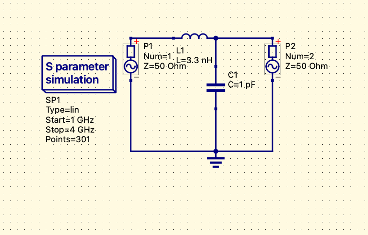

# RF Filter Characterization and S-Parameter Analysis Using Qucs-S

## Overview

This project demonstrates the design and simulation of a basic RF low-pass filter using Qucs-S and S-parameter analysis.

The objective was to study RF transmission behavior across frequency and understand filter response characteristics.

---

## Tools Used

* Qucs-S
* Qucsator
* S-Parameter Simulation

---

## Circuit Parameters

* Inductor: 3.3 nH
* Capacitor: 1 pF
* Port Impedance: 50 Ω
* Frequency Sweep: 1 GHz to 4 GHz

---

## Simulation Results

The simulation demonstrated low-pass filter behavior:

* Lower frequencies passed through the circuit
* Higher frequencies experienced attenuation
* S21 response changed across the frequency sweep

---

## Engineering Skills Demonstrated

* RF circuit simulation
* S-parameter characterization
* Frequency-domain analysis
* RF troubleshooting and debugging
* Qucs-S workflow understanding

---

## Challenges Solved

During this project, several practical simulation issues were debugged and resolved:

* Dataset generation issues
* S-parameter plotting problems
* Graph visualization troubleshooting
* Simulator configuration issues

---

## Project Screenshots

### RF Filter Circuit

### Simulation Graph

## Learning Outcome

Through this project, I gained practical experience in:

* RF filter design fundamentals
* S-parameter interpretation
* Frequency-domain simulation
* Transmission and reflection behavior
* RF circuit troubleshooting using Qucs-S

Return Loss and Reflection Analysis

The S11 parameter was analyzed to study input reflection behavior across frequency.

Observations:

Lower frequencies showed lower reflection
Reflection increased at higher frequencies
This confirms low-pass filter behavior and impedance mismatch at higher frequencies

Key Learning:

S11 represents reflected signal power at the input port
Increasing S11 indicates worsening impedance matching
