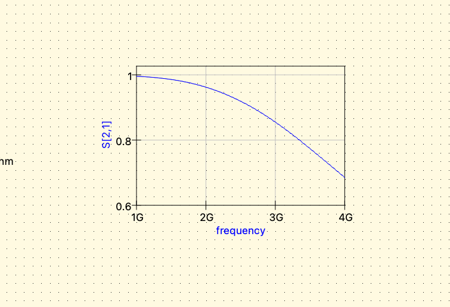
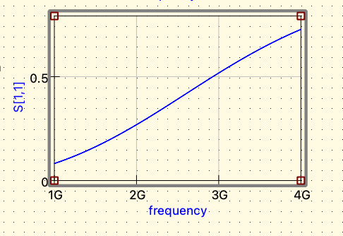
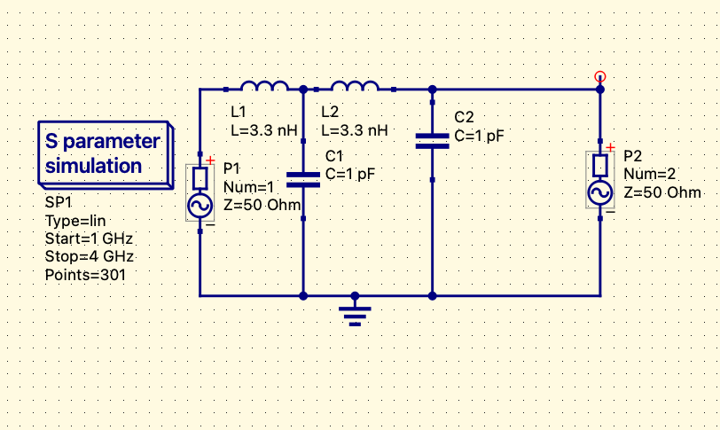
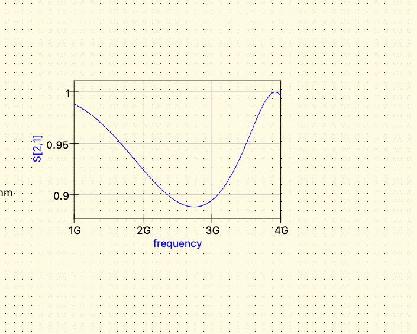

# RF Low-Pass Filter Characterization Using Qucs-S

## Overview

This project demonstrates the design and simulation of RF low-pass filters using Qucs-S and S-parameter analysis.

The project was expanded from a basic LC filter into a higher-order practical RF filter analysis project including Smith chart interpretation and practical component modeling.

---

## Tools Used

* Qucs-S
* Qucsator
* S-Parameter Simulation
* Smith Chart Analysis

---

## Basic Filter Design

The initial design used a simple LC low-pass filter configuration.

### Circuit Parameters

* Inductor: 3.3 nH
* Capacitor: 1 pF
* Port Impedance: 50 Ω
* Frequency Sweep: 1 GHz to 4 GHz

### Objectives

* Study RF transmission behavior
* Analyze S-parameters
* Observe low-pass filtering response

---

## Higher-Order Filter Design

The project was extended into a multi-stage higher-order low-pass filter.

### Implemented Features

* Two-stage LC filter
* Improved frequency selectivity
* Sharper attenuation response
* Multi-stage RF filtering

---

## Smith Chart Analysis

Smith chart analysis was performed using S11 data to observe impedance behavior and RF matching characteristics across frequency.

### Observations

* Frequency-dependent impedance variation
* Reflection behavior changes
* RF matching characteristics

---

## Practical vs Ideal Components

Real-world component behavior was analyzed by introducing series resistance into the inductors.

### Practical Component Modeling

* Added 1 Ω series resistance
* Observed insertion-loss degradation
* Compared ideal and non-ideal RF behavior

### Key Observation

Practical RF components introduce:
* insertion loss
* conductor loss
* non-ideal transmission behavior

---

## S-Parameter Analysis

### S21

Used to analyze transmission response across frequency.

### S11

Used to analyze reflection and impedance behavior.

---

## Key Learning Outcomes

* Understanding RF transmission behavior
* Performing S-parameter analysis
* Interpreting Smith charts
* Designing higher-order RF filters
* Comparing ideal and practical RF components
* Observing insertion-loss behavior
* Understanding RF impedance characteristics

---

## Project Screenshots
### Transmission Analysis

### Return Loss Analysis

### Higher-Order Filter

### Practical Component Analysis

